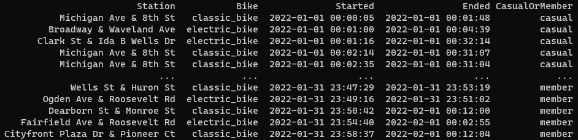
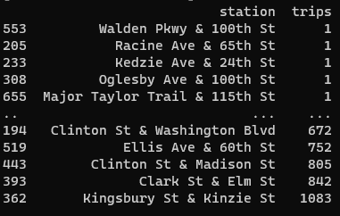
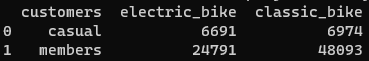
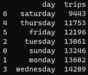
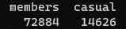
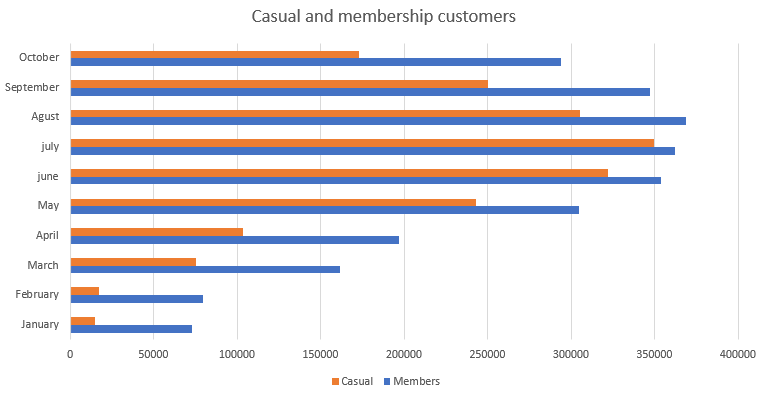
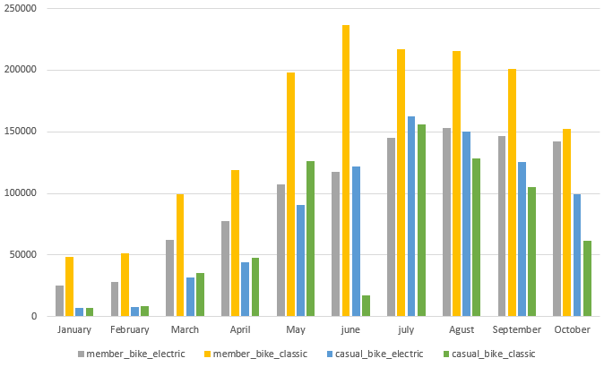

## Cyclistic
 Cyclistic's historical trip data for analyzing and identifying trends: [Dataset](https://divvy-tripdata.s3.amazonaws.com/index.html)

#### Use Python for clean values
- Debugging values for analysis
````(python)
def cleanValues(df):
    df.rename(columns={station: "Station", bike: "Bike", started: "Started",
                        ended: "Ended", memberType: "CasualOrMember"}, inplace=True)
    df.dropna(subset=["Station", "Bike", "Started",
                       "Ended", "CasualOrMember"], inplace=True)
    df = df.loc[:, ["Station", "Bike", "Started", "Ended",
                      "CasualOrMember"]].sort_values(by="Started")
    print(df)
````
- Rename values to manage

- Filtering stations and counting trips at each station
````(python)
def getStationTrip():
    data = []
    avist = []
    #lg = df.loc[:,["Station"]]
    lg = df["Station"]
    for row in lg:
        data.append(row)
    data = list(set(data))
    for row in data:
        check = df["Station"].value_counts()[row]
        avist.append(check)
    stationDf = {"station": data, "trips": avist}
    stationDf = pd.DataFrame(stationDf).sort_values(by="trips")
    print(stationDf)
````

- Filter bike type by customer type
````(python)
def getBikesMembers():
    bikeMembers = df.loc[:, ["Bike", "CasualOrMember"]]
    members = df.CasualOrMember.isin(["member"])
    members = bikeMembers[members]
    casual = df.CasualOrMember.isin(["casual"])
    casual = bikeMembers[casual]
    electricM = members["Bike"].value_counts()["electric_bike"]
    classicM = members["Bike"].value_counts()["classic_bike"]
    electricC = casual["Bike"].value_counts()["electric_bike"]
    classicC = casual["Bike"].value_counts()["classic_bike"]
    bikesType = {"customers": ["casual", "members"], "electric_bike": [
        electricC, electricM], "classic_bike": [classicC, classicM]}
    bikesType = pd.DataFrame(bikesType)
    print(bikesType)
````

- Filter the number of trips for each day of the week.
````(python)
def getWeekDay():
    st = df["Started"]
    days = [0, 1, 2, 3, 4, 5, 6]
    weekDay = []
    trips = []
    for row in st:
        day = datetime.strptime(row, '%Y-%m-%d %H:%M:%S')
        weekDay.append(day.weekday())
    table = {"week_day": weekDay}
    mean = pd.DataFrame(table).sort_values(by="week_day")
    for row in days:
        day = mean["week_day"].value_counts()[row]
        trips.append(day)
    tripsDay = {"day": ["sunday", "monday",
                        "tuesday", "wednesday", "thursday", "friday", "saturday"], "trips": trips}
    tripsDay = pd.DataFrame(tripsDay).sort_values(by="trips")
    print(tripsDay)
````

- Filters number of casual and membership customers
````(python)
def getMembers():
    bikeMembers = df.loc[:, ["CasualOrMember"]]
    members = bikeMembers.value_counts()["member"]
    casual = bikeMembers.value_counts()["casual"]
    mean = {"members": [members], "casual": [casual]}
    mean = pd.DataFrame(mean)
    print(mean)
````

### Casual vs Membership customers in recent months

The number of customers with a subscription has grown significantly, as have the number of casual customers until July, when there has been a significant reduction.

### Types of bicycles by customer

Membership customers prefer classic bikes, it would be good to invest in improving these bikes to attract more members.