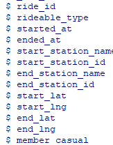

## Cyclistic
- Cyclistic's historical trip data for analyzing and identifying trends: [202210-divvy-tripdata.zip](https://divvy-tripdata.s3.amazonaws.com/index.html)

#### Data are organized in a spreadsheet


````(r)
cyclistic <- read.csv("202210-divvy-tripdata.csv")
````
Next columns




Identify bias
````(r)
cyclistic <- read.csv("202210-divvy-tripdata.csv")
````


