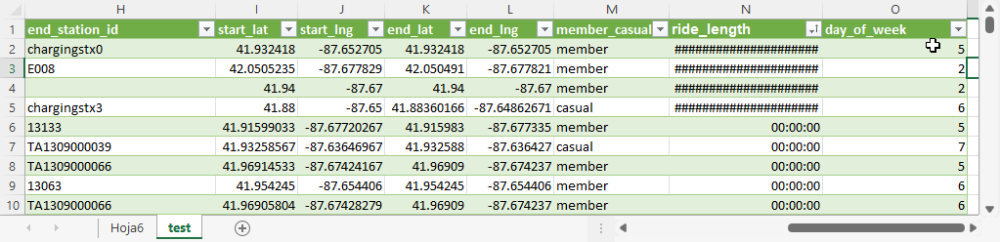
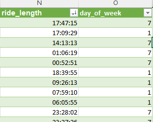
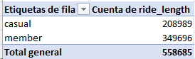
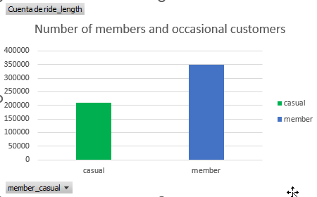
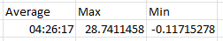
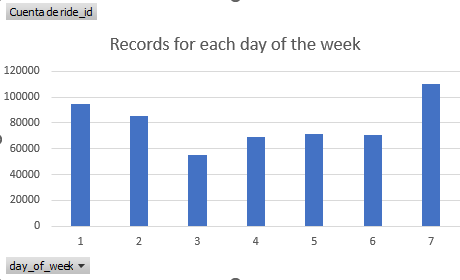

## Cyclistic
 Cyclistic's historical trip data for analyzing and identifying trends: [202210-divvy-tripdata.zip](https://divvy-tripdata.s3.amazonaws.com/index.html)

#### Use of spreadsheets
- Data are organized in a spreadsheet

- Columns are added to calculate the start and end time of the service. Also to set the day of the week

- Number of members and occasional customers



- The average, maximum and minimum usage time is calculated

- Records for each day of the week



````(r)
cyclistic <- read.csv("202210-divvy-tripdata.csv")
````
Next columns

Identify bias
````(r)
cyclistic <- read.csv("202210-divvy-tripdata.csv")
````


